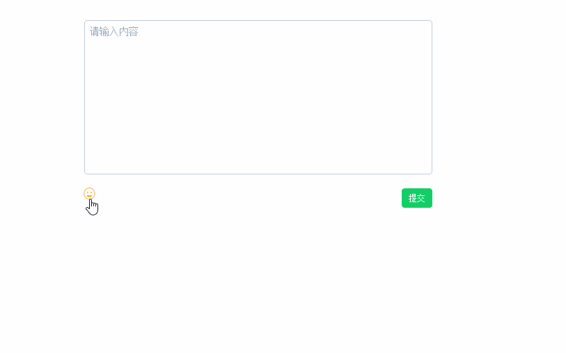

# vue-emoji


> 最近公司需求做个类似于QQ空间的项目(其实开始的时候我是崩溃的),好在历时一个月的时间,也终于进入测试的阶段。
> 完成项目过程中，发现并没有一个好用的emoji插件，于是写了一个简单的component，希望对各位有所帮助（若能顺手给个start, 那再好不过了）。

原理其实很简单，雪碧图+背景定位的方式实现。





源码地址： https://github.com/jkchao/vue-emoji

## Build Setup

``` bash
# install dependencies
npm install

# serve with hot reload at localhost:8080
npm run dev

# build for production with minification
npm run build

```

